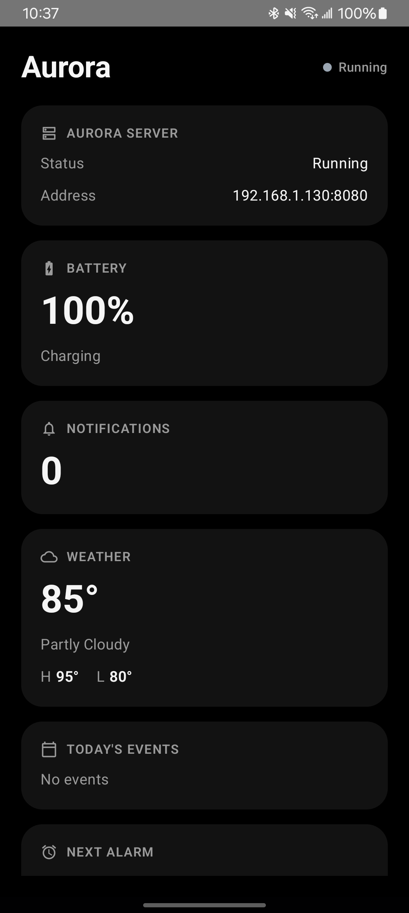
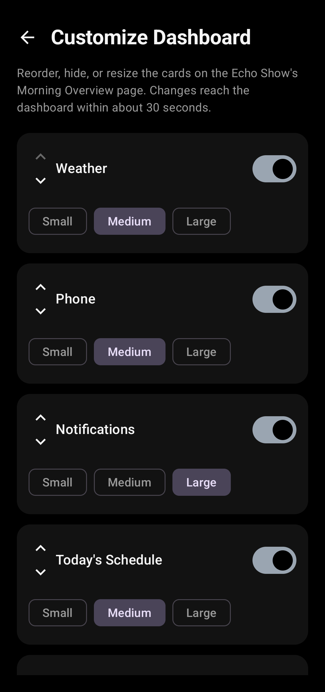

# Aurora


Aurora turns an Android phone into the backend for a self-hosted bedside
smart display. It reads live data straight off the phone — battery,
notifications, calendar, alarms, weather — and a bedside sound machine you
control from your phone but that actually plays through the display's own
speakers, then serves all of it as JSON over your home Wi-Fi to
[**echo-dashboard**](https://github.com/rustyisacat/echo-dashboard), a companion
kiosk frontend built for a repurposed Amazon Echo Show.

No cloud account, no subscription, no third-party server in the loop —
just your phone talking HTTP to a screen on the same network.

<p align="center">
  
  
</p>

## What's new in v3.0

Aurora's own surface is smaller this release — most of v3.0's work went
into the dashboard side (see
[echo-dashboard](https://github.com/rustyisacat/echo-dashboard)'s README:
polish animations, animated weather backgrounds, 8 selectable Dashboard
Themes, a one-tap Bedside Mode, an idle-triggered Ambient Mode, and
wallpaper-matched color theming). What Aurora itself gained is the photo
backend those last two features needed:

- **Choose Photos**: pick a handful of photos from your gallery via
  Android's Photo Picker — no storage permission needed, since the picker
  itself only grants access to what you actually select. Persisted across
  restarts and served to the dashboard, which cycles them for both Ambient
  Mode's screensaver and the main dashboard's own rotating wallpaper.
- **Rain forecast**: weather now includes the next upcoming hour with a
  high chance of rain, if any, so the dashboard can nudge you to bring an
  umbrella before you head out.
- **Do Not Disturb**: toggle the phone's real system DND from the
  dashboard — Aurora only acts on it if you've already granted
  notification policy access on the phone.

## What's new in v2.0

- **Runs in the background, not just while the app is open.** A foreground
  service keeps the server alive after you close the app, starting and
  stopping automatically based on whether the phone is on the home Wi-Fi
  network — no more leaving Aurora open all night.
- **Home network is configured on the phone, not hardcoded.** First launch
  auto-detects the Wi-Fi subnet you're on and asks you to confirm it
  (editable later from "Change Home Network"), so this works out of the
  box for anyone who clones the repo, not just the original author's router.
- **Weather now follows the phone automatically** (location-based, with a
  fixed-coordinate fallback if location isn't available) and includes
  sunrise/sunset.
- **The calendar card is time-aware:** it shows today's events before
  noon, then switches to tomorrow's from noon onward and resets at
  midnight — so you wake up to what's ahead today, and go to bed seeing
  what's ahead tomorrow.
- **Wake Alarms**: Aurora's own alarm clock, entirely independent of the
  phone's stock Clock app. Set one or several (with repeat days) from the
  Echo Show dashboard, and when one fires it rings *there* — full volume,
  looped, with Dismiss/Snooze — not on the phone. See
  [Why a separate alarm clock](#why-a-separate-alarm-clock) below for why
  this wasn't built by reading/silencing the phone's own alarms.

## Features

- **Live phone status**: battery level/charging state, notification count
  (grouped by app), calendar events (today or tomorrow, see above), next
  alarm — all pulled and served as one JSON snapshot.
- **Weather**: current conditions plus sunrise/sunset via
  [Open-Meteo](https://open-meteo.com/) (no API key needed), resolved from
  the phone's own location, cached and refreshed in the background.
- **Wake Alarms**: Aurora's own alarm clock, scheduled with
  `AlarmManager.setAlarmClock()` (survives Doze and reboots), managed from
  the Echo Show dashboard, rings on the display rather than the phone.
- **Bedside Sound Machine**: pick a built-in ambient sound or import your
  own (Storage Access Framework), control play/pause/stop/volume/sleep
  timer from either the phone or the dashboard — Aurora only tracks
  *desired* state, the dashboard's browser does the actual audio playback
  through the display's speakers. Automatically stops if a wake alarm
  starts ringing.
- **Runs persistently, only when it needs to**: a foreground service keeps
  the server alive independent of the app being open, active only while
  the phone is on the configured home Wi-Fi network.
- **Dashboard customization**: reorder, hide, or resize the dashboard's
  cards, right from the phone app — no code changes needed.
- **Ambient Mode photos & rotating dashboard wallpaper**: pick photos via
  Android's Photo Picker (no storage permission needed); the dashboard
  cycles the same library for both its idle screensaver and its
  main-screen wallpaper — served over HTTP the same way custom sounds are,
  Aurora never renders anything itself.
- **Rain forecast & Do Not Disturb**: weather includes a next-rain-hour
  nudge for the dashboard's "bring an umbrella" warning, and the dashboard
  can flip the phone's real system DND on and off.
- **Zero cloud dependency**: everything is plain HTTP on your LAN.

## How it fits together

```
┌─────────────────┐        HTTP (LAN, port 8080)        ┌──────────────────┐
│  Aurora (phone)  │ ───────────────────────────────────▶│  echo-dashboard  │
│                  │◀─────────────────────────────────── │  (kiosk display) │
└─────────────────┘        pulls every 30s               └──────────────────┘
```

Aurora runs an embedded HTTP server ([NanoHTTPD](https://github.com/NanoHttpd/nanohttpd))
inside a foreground service, independent of whether the app itself is open,
active only while the phone is on the home Wi-Fi network you've configured.
The dashboard — a static HTML/CSS/JS kiosk page, see
[echo-dashboard](https://github.com/rustyisacat/echo-dashboard) — pulls it every
30 seconds and renders the result. Both devices just need to be on the
same Wi-Fi network.

### Why a separate alarm clock

Wake Alarms were originally going to work by reading the phone's existing
alarms and silencing them when the Echo Show should ring instead. That
turned out to not be reliably possible: Android has no public API for a
third-party app to enumerate another app's set alarms — the stock Clock
app's alarm list lives in that app's own, often OEM-specific, private
database — let alone silence one mid-ring. Building the alarm inside
Aurora sidesteps all of that entirely: Aurora never needs to make noise on
the phone in the first place, since the Echo Show is what actually rings.

## Requirements

- An Android phone, API 26+ (Android 8.0), with a working Wi-Fi connection.
- [Android Studio](https://developer.android.com/studio) or a standalone
  JDK 17+ to build.
- A display to point [echo-dashboard](https://github.com/rustyisacat/echo-dashboard)
  at — this was built for a rooted Amazon Echo Show 5 in kiosk mode, but
  any device with a browser on the same network works.

## Installation

1. **Clone and open the project:**

   ```
   git clone https://github.com/rustyisacat/Aurora.git
   cd Aurora
   ```

   Open it in Android Studio, or build straight from the command line:

   ```
   ./gradlew assembleDebug
   ```

   The APK lands at `app/build/outputs/apk/debug/app-debug.apk`.

2. **Install it on your phone** (via Android Studio's Run button, or):

   ```
   adb install -r app/build/outputs/apk/debug/app-debug.apk
   ```

3. **Launch Aurora and answer the two first-launch prompts:**
   - What the dashboard should call you.
   - Your home network — auto-detected from whatever Wi-Fi you're
     currently on, just confirm or edit it. This is what the background
     service checks before it'll run the server, so it only ever serves
     the dashboard from home.

   The app then shows its LAN address (e.g. `192.168.1.130:8080`) — tap
   **Copy Dashboard URL** to grab it.

4. **Grant permissions** when prompted:
   - **Notification access** (Settings deep link from the app) — needed
     for the notification count/grouping.
   - **Calendar access** (standard runtime dialog) — needed for calendar
     events.
   - **Location access** (coarse) — needed for weather to follow the phone
     automatically instead of a fixed fallback coordinate.
   - **Notifications** (POST_NOTIFICATIONS, Android 13+) — needed to show
     the background service's persistent status icon; the server still
     runs without it, you just won't see the icon.
   - **Do Not Disturb access** (Settings deep link from the app) — needed
     for the dashboard's DND toggle to actually change the phone's system
     DND state; without it the toggle silently no-ops.

   All of these are optional — declining any of them degrades that one
   feature gracefully instead of crashing the app.

5. **Point [echo-dashboard](https://github.com/rustyisacat/echo-dashboard) at
   Aurora's address** — see that repo's README for setup.

## Configuration

Everything that used to be a hardcoded value in this repo is now
configured from the app itself on first launch: home network (see
Installation above) and location-based weather. If location permission is
denied or no fix is ever obtained, weather falls back to a fixed
coordinate in `weather/WeatherConfig.kt` — update that if you'd rather set
a permanent location than grant location access.

## API

`GET /health` → `Aurora OK`

`GET /dashboard` → one JSON snapshot of everything the display needs:

```json
{
  "battery": 82,
  "charging": true,
  "notifications": 5,
  "notificationGroups": [{ "app": "Messages", "count": 3 }],
  "nextAlarm": { "time": "07:00", "enabled": true },
  "calendar": [{ "title": "School", "start": "08:00", "end": "15:00", "allDay": false }],
  "calendarShowsTomorrow": false,
  "weather": { "temperature": 74, "condition": "Clear", "high": 86, "low": 68, "timezone": "America/New_York", "sunrise": "06:15", "sunset": "20:42", "rainExpectedAt": null },
  "soundMachine": { "playing": false, "sound": null, "volume": 50, "sleepTimerMinutes": null },
  "wakeAlarms": [{ "id": "…", "hour": 6, "minute": 30, "daysOfWeek": [2, 3, 4, 5, 6], "enabled": true, "label": "", "soundId": "rain" }],
  "wakeAlarmRinging": { "ringing": false, "alarmId": null, "label": "", "soundId": null },
  "layout": [{ "id": "weather", "visible": true, "size": "medium" }],
  "dndEnabled": false
}
```

Absent values are always an explicit JSON `null` (or `[]`/`{}`), never an
omitted key — the response shape never changes based on what data happens
to be available. `nextAlarm` reflects whichever of the phone's stock Clock
app or Aurora's own Wake Alarms fires soonest; `wakeAlarms`/
`wakeAlarmRinging` are Aurora's own alarms specifically.

Sound Machine control routes (`POST /sound/play`, `/sound/pause`,
`/sound/stop`, `/sound/volume`, `/sound/timer`, `GET /sound/library`,
`GET /sound/stream`), Wake Alarm control routes (`GET /wakealarms`,
`POST /wakealarms/set`, `/wakealarms/delete`, `/wakealarms/dismiss`,
`/wakealarms/snooze`), the photo routes (`GET /photos/library`,
`GET /photos/stream`), and `POST /dnd/set` exist for the dashboard's own
use — see [echo-dashboard](https://github.com/rustyisacat/echo-dashboard).

## Architecture

```
com.rusty.aurora
├── api/            HTTP layer: NanoHTTPD server + one Route per endpoint
├── alarm/          AlarmRepository - the phone's stock alarm, reconciled against wakealarm/'s own
├── battery/        BatteryRepository - wraps android.os.BatteryManager
├── calendar/       CalendarRepository - today's events before noon, tomorrow's from noon on
├── layout/         Dashboard tile order/visibility/size, persisted + served
├── location/       LocationRepository - best-effort last-known location for weather
├── network/        HomeNetworkMonitor/Repository - user-configured home Wi-Fi subnet detection
├── notifications/  NotificationCountRepository + the NotificationListenerService + DndRepository
├── photo/          Photo Picker-backed library, shared by Ambient Mode and the dashboard's rotating wallpaper
├── profile/        UserProfileRepository - the first-launch name prompt
├── service/        AuroraBackgroundService (persistent server) + AuroraServerController
├── sound/          Sound Machine state, library, sleep timer (Aurora never plays audio itself)
├── wakealarm/      Aurora's own alarm clock - scheduling, ringing state, HTTP routes
├── weather/        WeatherRepository - cached Open-Meteo client, location-aware, includes rain forecast
├── di/             Hand-rolled composition root (AppContainer)
├── model/          Serializable response DTOs, shared enums
├── ui/             Compose screens, ViewModel, MainActivity, theme
└── util/           NetworkUtil (LAN IP, Wi-Fi-specific IP), NotificationAccessUtil, DndAccessUtil
```

**Design principles this codebase follows throughout:**

- `api/` never contains business logic — `AuroraHttpServer` just matches
  a request against a `List<Route>` and delegates; each `Route` owns
  exactly one endpoint.
- Every data source is a repository *interface* (`BatteryRepository`,
  `WeatherRepository`, `SoundRepository`, `WakeAlarmRepository`, ...) —
  callers depend on the interface, never the concrete Android/network
  type, which is what makes them fake-able in tests.
- Pure logic is split out from Android/network glue wherever a repository
  does real transformation (`CalendarEventMapper`, `WeatherCache`,
  `SleepTimerCalculator`, `NotificationGrouper`, `NextTriggerCalculator`,
  ...) — these have no Android dependency and are covered by plain JVM
  unit tests.
- `di/AppContainer` is a hand-rolled object graph, not Hilt/Koin — still
  comfortably manageable by hand at this size, and every class still takes
  its dependencies through its constructor.
- Aurora never plays audio itself, for the sound machine *or* wake
  alarms — both track desired state and serve raw bytes; the dashboard's
  browser does actual playback through the display's speakers, so bedside
  audio survives Aurora's own process being killed by Android.
- Nothing that only makes sense for one person's setup is hardcoded
  anymore (home network, weather location-with-fallback) - this is a
  public repo, and a fixed value baked into source only ever worked for
  the original author's router.

## Building & testing

Toolchain: AGP 9.3.0, Kotlin 2.2.10, Gradle 9.5.0, compileSdk/targetSdk 36,
minSdk 26.

```
./gradlew assembleDebug        # debug APK
./gradlew testDebugUnitTest    # all unit tests (plain JVM, no device needed)
./gradlew assembleRelease      # release variant, lint included
```

All tests are plain JVM unit tests under `app/src/test` — no emulator or
Robolectric required. They cover the HTTP layer end-to-end (a real
`AuroraHttpServer` on an ephemeral port, hit over real HTTP) and every pure
transformation function (calendar mapping, weather caching/parsing, sleep
timer math, notification grouping, wake alarm next-trigger scheduling
math). Thin Android-integration edges (`CalendarRepositoryImpl`,
`AlarmRepositoryImpl`, `WeatherRepositoryImpl`, `SoundRepositoryImpl`,
`WakeAlarmRepositoryImpl`) are intentionally left to manual device
verification instead, since they hold no real logic of their own.

## Roadmap

Ideas not yet built, following the same repository-interface +
`DashboardResponse`-field pattern established so far: charging time
estimate, more built-in sound machine tracks, alarm-specific volume
separate from the ambient sound machine's.

## AI Disclaimer

Parts of this project were assisted or written by AI. If that's something
you're not comfortable with, no hard feelings, I understand and I don't
force anyone to use it. The code may have flaws. If you spot something
that could be better, contributions are very welcome. I'm still learning
and would appreciate the help.

## License

[MIT](LICENSE)
